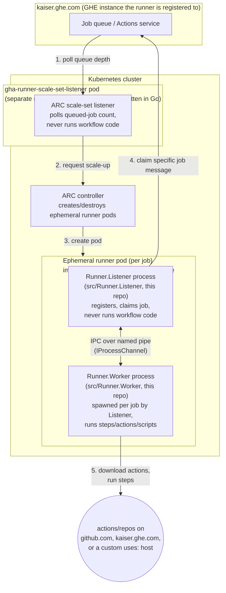
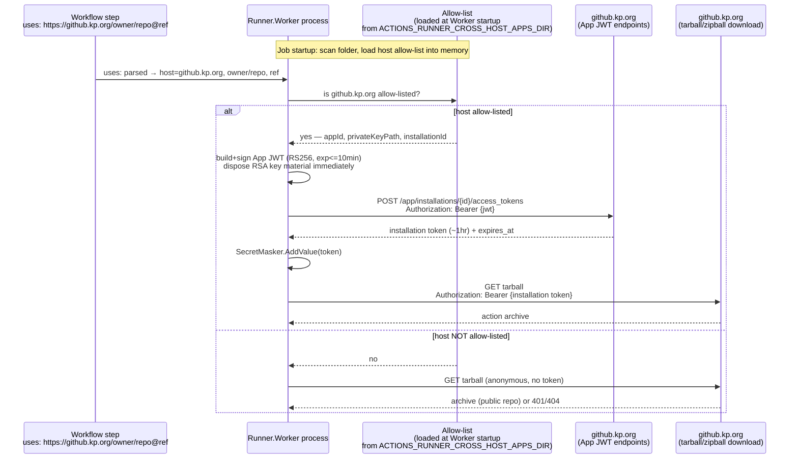

# Secure cross-host authentication for custom `uses:` URLs

**Status**: Implemented (`src/Runner.Worker/CrossHostAppTokenProvider.cs`, commit `60b17d82`).
A stronger-isolation alternative (mint tokens in `Runner.Listener` instead of `Runner.Worker`) is
documented separately for future hardening: [secure_app_id_listener_option.md](secure_app_id_listener_option.md).

**Related**: [docs/adrs/fork-0001-custom-uses-url.md](../adrs/fork-0001-custom-uses-url.md)

## Problem

The custom-URL `uses:` feature ([fork-0001-custom-uses-url.md](../adrs/fork-0001-custom-uses-url.md))
lets a step reference an action on a host other than the one the runner is registered against
(`uses: https://<host>/<owner>/<repo>@ref`). The question this doc answers is: **how does that
download authenticate to the other host?**

Naively reusing the job's own `GITHUB_TOKEN` is both wrong and dangerous. That token is issued by
the runner's own registered server (e.g. `kaiser.ghe.com`) and is **not** valid on a different
GitHub Enterprise instance (e.g. `github.kp.org`) — separate instances are separate identity
realms and don't share tokens. Worse, forwarding it to whatever host a workflow author names in
`uses:` is a credential-exfiltration risk: a malicious `uses:` value could leak the token to an
attacker-controlled host.

**Rule: default-deny.** Only hosts on an explicit allow-list ever get a token attached to the
download request. Every other host gets an anonymous request (fine for public repos) — never the
primary `GITHUB_TOKEN`, never any other host's credential.

## How to set this up

### 1. Create a GitHub App on the target host

On the host you want to allow cross-host `uses:` downloads from (e.g. `github.kp.org`):

1. Create a GitHub App (org or enterprise settings → Developer settings → GitHub Apps).
2. Grant it repository permission **Contents: Read-only** (that's all `tarball`/`zipball` download
   needs). Add more only if your actions also need it.
3. Install the App on the org(s)/repo(s) that hold the actions you want to reference.
4. Note the **App ID** (shown on the App's settings page).
5. Generate a private key for the App ("Generate a private key" button) — this downloads a `.pem`
   file once; there's no way to re-download it later, only regenerate a new one.
6. Optional: note the **Installation ID** from the URL of the installed-app settings page
   (`.../settings/installations/<id>`) if you want to pin it in config instead of relying on
   dynamic lookup by owner.

### 2. Place the private key on the runner

Copy the downloaded `.pem` file onto the runner host/image at a path the runner service account
can read and nothing else can — mirror this repo's own convention for its RSA registration key:

```bash
sudo mkdir -p /etc/actions-runner/keys
sudo cp github-kp-org-app.pem /etc/actions-runner/keys/github-kp-org-app.pem
sudo chown <runner-service-user> /etc/actions-runner/keys/github-kp-org-app.pem
sudo chmod 600 /etc/actions-runner/keys/github-kp-org-app.pem
```

For a container/ARC deployment, mount this from a Kubernetes Secret instead of baking it into the
image.

### 3. Write the allow-list config

Create the config directory (default `<runner_root>/.cross_host_apps/`, or point
`ACTIONS_RUNNER_CROSS_HOST_APPS_DIR` at a directory of your choice) and add a `*.json` file. The
minimal entry is a host plus one GitHub App (`appId` + `privateKeyPath`):

```bash
mkdir -p /actions-runner/.cross_host_apps
cat > /actions-runner/.cross_host_apps/github-kp-org.json <<'EOF'
{
  "hosts": [
    {
      "host": "github.kp.org",
      "appId": "123456",
      "privateKeyPath": "/etc/actions-runner/keys/github-kp-org-app.pem"
    }
  ]
}
EOF
```

To back different owners on the same host with different GitHub Apps, add an `owners` list. Each
owner entry has its own `appId`/`privateKeyPath`; the host-level `appId`/`privateKeyPath` (if you
keep them) act as the default App for any owner not listed:

```json
{
  "hosts": [
    {
      "host": "github.kp.org",
      "appId": "123456",
      "privateKeyPath": "/etc/actions-runner/keys/default-app.pem",
      "owners": [
        { "owner": "team-a", "appId": "222222", "privateKeyPath": "/etc/actions-runner/keys/team-a-app.pem" },
        { "owner": "team-b", "appId": "444444", "privateKeyPath": "/etc/actions-runner/keys/team-b-app.pem" }
      ]
    }
  ]
}
```

- A `uses:` from `team-a` or `team-b` on `github.kp.org` uses that owner's own App; any other owner
  on the same host falls back to the host-level default App (if one is configured).
- Drop the host-level `appId`/`privateKeyPath` if every owner you care about has its own `owners`
  entry — owners without an explicit entry then get anonymous requests instead of a default App.
- A broken entry (missing fields or unreadable key file) fails loud for just that host/owner; it
  never silently downgrades to anonymous or affects other entries.

`installationId` is optional and deliberately left out of the examples above — **you never need
it.** Add it to any entry only as an optimization; see the
[field reference](#config-format-and-token-minting-flow) below for exactly what it does. The
allow-list is loaded once per `Runner.Worker` process (once per job), so no runner restart is
needed — the next job picks up config changes.

### 4. Reference it from a workflow

No special syntax beyond the custom-URL `uses:` form already documented in
[fork-0001-custom-uses-url.md](../adrs/fork-0001-custom-uses-url.md):

```yaml
steps:
  # repo-root action
  - uses: https://github.kp.org/owner/some-action@v1
  # action stored in a subdirectory of a repo
  - uses: https://github.kp.org/owner/repo/.github/actions/github-checkout-action@v10.5.0
```

**How the owner is derived**: the path segment right after the host is always the owner,
regardless of whether a subdirectory path follows. For
`https://github.kp.org/owner/repo/.github/actions/github-checkout-action@v10.5.0`, the runner
parses `owner/repo/.github/actions/github-checkout-action` into repository `owner/repo` and action
path `.github/actions/github-checkout-action`; `owner` (the first segment) is what gets checked
against the allow-list and, for `owners` entries, matched to `account.login` when resolving an
installation dynamically. This is the exact same parsing GitHub itself uses for `owner/repo@ref` —
the custom-URL form just adds a `scheme://host/` prefix in front of it.

**Scope note**: this covers step-level `uses:` (actions), which is what `ActionManager` in this
fork handles. It does not extend to job-level `uses:` for calling reusable workflows
(`jobs.<job_id>.uses: owner/repo/.github/workflows/workflow.yml@ref`) — that's a different code
path in the runner and isn't affected by this feature.

If `github.kp.org` is allow-listed, the download is authenticated with a freshly minted GitHub App
installation token. If it isn't, the download is anonymous (works for public repos, fails for
private ones with a normal 404/403 from the download itself — not a runner-level error).

### 5. Troubleshooting

All of these come from `CrossHostAppTokenProvider` and are visible in the job's `resolve_actions`/
`download_action` step output:

| Message | Cause | Fix |
| --- | --- | --- |
| `Cross-host app entry for host '<host>' is misconfigured: '<file>' is missing required field(s) appId/privateKeyPath.` | The JSON entry is missing `appId` or `privateKeyPath`. | Fix the JSON file for that host. |
| `Cross-host app entry for host '<host>' is misconfigured: private key file '<path>' not found.` | `privateKeyPath` doesn't point to a real, readable file. | Check the path and file permissions. |
| `Unable to read GitHub App private key file '<path>': ...` | File exists but couldn't be read (permissions, disk error). | Check ownership/permissions match the runner service account. |
| `Private key file '<path>' is not a valid PEM-encoded RSA private key.` | Wrong file, or corrupted/re-encoded key. | Re-download the key from the App's settings page. |
| `No GitHub App installation found for owner '<owner>' on host '<host>'.` | `installationId` omitted and the App isn't installed on that owner's account. | Install the App on that owner (org or user account), or set `installationId` explicitly. |
| `Failed to list GitHub App installations on host '<host>' (HTTP ..., request id: ...)` / `Failed to mint a GitHub App installation token ...` | Network/API error talking to the host, or App ID is wrong. | Check connectivity to the host's API, and that `appId` matches the App exactly. |

A host that's simply **not mentioned** in any allow-list file is not an error — it's the normal
case for public actions and results in a plain anonymous download.

## What already exists in this codebase vs. what's net-new

There is **no existing "load a GitHub App ID + private key" system** in this runner today. What
does already exist is adjacent infrastructure worth reusing as a foundation rather than building
from scratch:

| Existing component | What it actually does | Reusable for this feature? |
| --- | --- | --- |
| `RSAFileKeyManager` / `RSAEncryptedFileKeyManager` (`src/Runner.Listener/Configuration/`) | Stores the **runner's own** RSA keypair used during runner *registration* (proving the runner's identity to the Actions service). Linux/macOS: plain file + `chmod 600`. Windows: DPAPI-encrypted file. | **Yes, as a pattern to mirror** for how the GitHub App private key file is protected at rest. Not a literal loader for App keys — a different keypair, different purpose — but the exact secure-storage convention we should copy. |
| `GitHub.Services.WebApi.Jwt.JsonWebToken` (`src/Sdk/WebApi/WebApi/Jwt/`) | General-purpose RS256 JWT builder, but requires an `Audience` claim and is shaped for VSTS/Azure DevOps-style tokens. | **Not a good fit as-is.** GitHub App JWTs don't use an audience and have a fixed 10-minute max lifetime. Cheaper/cleaner to hand-roll the ~20 lines of JWT construction directly with `System.Security.Cryptography.RSA` than to fight this class's assumptions. |
| `IProcessChannel` IPC between `Runner.Listener` and `Runner.Worker` (`JobDispatcher.cs`) | Already carries the job message, secrets, and (recently) `ActionsDependencies` from Listener to Worker. | Not used by the implemented approach — only relevant if you later move token-minting into `Runner.Listener`. See [secure_app_id_listener_option.md](secure_app_id_listener_option.md). |

So: nothing to "turn on," but nothing to invent from zero either. The implemented approach builds
on the existing secure-file-storage convention above.

## Process architecture context

Two different "listener" concepts are easy to conflate, so it's worth being explicit — this is
also what makes the alternative design in
[secure_app_id_listener_option.md](secure_app_id_listener_option.md) viable.

- **ARC's scale-set listener** (`gha-runner-scale-set-listener`) is a separate component from a
  separate repo (`actions-runner-controller`, written in Go). It runs in its own pod, polls GitHub
  for queued-job counts, and asks Kubernetes to spin up ephemeral runner pods. It contains none of
  this repo's source and never runs workflow code.
- **This repo's `Runner.Listener`** (`src/Runner.Listener`) is a different thing that happens to
  share the word "listener." It runs *inside* each runner pod/VM, registers with the Actions
  service, claims job messages, and — critically — never executes workflow-authored code itself.
- **`Runner.Worker`** (`src/Runner.Worker`) is spawned by `Runner.Listener` as a **separate OS
  process**, once per job, over a named-pipe IPC (`IProcessChannel`). It's the process that
  actually runs steps/actions/scripts — the untrusted-code-execution surface.

The container image ARC uses (built via [images/Dockerfile](../../images/Dockerfile)) packages
both `Runner.Listener` and `Runner.Worker` binaries into one image, but they still run as two
separate processes at runtime, exactly like a bare VM install.



In ARC's ephemeral mode, a runner pod (and so `Runner.Listener` within it) typically lives for only
one job before being torn down — it isn't "long-lived across many jobs" the way a persistent
VM-installed runner's Listener is. That said, `Runner.Listener` never executes workflow code
either way, regardless of pod lifetime — which is exactly what makes the alternative design in
[secure_app_id_listener_option.md](secure_app_id_listener_option.md) viable if you want the App
private key out of the Worker process entirely.

### Custom `uses:` URL + cross-host token flow (as implemented)



The primary `GITHUB_TOKEN` never appears anywhere in this flow — that's the fix for the
credential-leak issue described above. A stronger-isolation alternative that mints in
`Runner.Listener` instead exists as a documented (not implemented) option; see
[secure_app_id_listener_option.md](secure_app_id_listener_option.md) if you want to compare the
trade-offs.

## Config format and token-minting flow

### Startup: folder-based allow-list

At `Runner.Worker` startup, scan a configurable directory for `*.json` allow-list files and merge
them into a single in-memory list. Supporting multiple files (rather than one monolithic file)
lets different teams/hosts each own their own file without merge conflicts.

- Directory location: `ACTIONS_RUNNER_CROSS_HOST_APPS_DIR` environment variable, defaulting to
  `<runner_root>/.cross_host_apps/` if unset.
- Each file contains one or more host entries; a host entry may set host-level fields (used as
  the default App for that host), an `owners` list (per-owner overrides), or both:

```json
{
  "hosts": [
    {
      "host": "github.kp.org",
      "appId": "123456",
      "privateKeyPath": "/etc/actions-runner/keys/github-kp-org-app.pem",
      "owners": [
        { "owner": "team-a", "appId": "222222", "privateKeyPath": "/etc/actions-runner/keys/team-a-app.pem" }
      ]
    }
  ]
}
```

- `privateKeyPath` is a path to a PEM file, **never inline key material in the JSON**. The PEM
  file must be readable only by the runner service account — same file-permission convention this
  repo already uses for its own RSA registration key
  (`RSAFileKeyManager`: `chmod 600` on Linux/macOS; `RSAEncryptedFileKeyManager`: DPAPI on Windows).
- `installationId` is optional at every level and is omitted from the examples above. When absent,
  the runner resolves it at mint time via `GET {apiBase}/app/installations`, matching
  `account.login` against the `uses:` owner. Pin it explicitly only to save that one lookup call
  per mint, or to avoid calling an endpoint that lists every account the App is installed on —
  behaviour is otherwise identical.
- **Resolution order per (host, owner)**: an `owners` entry matching the owner wins if present;
  otherwise the host-level default (if configured) applies; otherwise the request is anonymous.
  A broken match (missing fields, bad key file) throws rather than falling through to the next
  option — it fails loud specifically for the (host, owner) pair that matched it, not for
  everything else on that host.
- **Host and owner matching is exact, case-insensitive string equality** — never
  `EndsWith`/`Contains` — so e.g. `github.kp.org.evil.com` can never match an allow-list entry for
  `github.kp.org`, and `team-a-fake` can never match an `owners` entry for `team-a`.

### Token minting flow

Performed lazily, the first time a job's `uses:` references an allow-listed host; cached in memory
for the remainder of that job (the Worker process is per-job, so no cross-job cache is needed).

1. Build a GitHub App JWT: header `{"alg":"RS256","typ":"JWT"}`, payload
   `{"iat": now-60, "exp": now+540, "iss": appId}` (9-minute lifetime, comfortably under
   GitHub's 10-minute max; `iat` backdated 60s for clock skew). Sign with `RSA.Create()` +
   `ImportFromPem` + RS256. Dispose the `RSA` object immediately after signing to clear key
   material from memory.
2. Determine the REST API base using the same github.com-vs-GHES convention already built for the
   custom-URL feature (`UrlUtil.IsHostedServer`): `api.{host}` for a dotcom-style host,
   `{host}/api/v3` for a GHES-style host.
3. If no `installationId` configured, resolve it via `GET {apiBase}/app/installations`.
4. `POST {apiBase}/app/installations/{id}/access_tokens` with `Authorization: Bearer {jwt}` →
   returns `{token, expires_at}` (typically 1 hour).
5. `HostContext.SecretMasker.AddValue(token)` immediately on mint, before the token is used
   anywhere else — same as the existing code already does for the primary `GITHUB_TOKEN`.
6. Use the minted token as `ActionDownloadInfo.Authentication.Token` for that action's download,
   exactly the same integration point the custom-URL feature already uses.
7. Refresh proactively if the cached token is within 5 minutes of `expires_at`.

### Fail-closed rules

- Host/owner combination not matched by any host-level default or `owners` entry → no token
  attached (anonymous request), never the primary `GITHUB_TOKEN`, never another host's credential.
- A host-level default or `owners` entry that IS matched but is broken (missing fields, bad key
  file) → fail the action download with a clear error naming the host (and owner, for a broken
  `owners` entry), rather than silently falling back to anonymous or to a less-specific match — that
  would mask a misconfiguration.
- No installation found for the target owner (when `installationId` is resolved dynamically) →
  same fail-loud treatment.
- Any minted token is added to the secret masker before use.

### Code locations

- `src/Runner.Worker/CrossHostAppTokenProvider.cs` — the allow-list loader + JWT/token-minting
  component (`ICrossHostAppTokenProvider`, resolved via `HostContext.GetService<T>()`, lazily
  loads the allow-list on first use).
- `ActionManager.BuildCustomUrlDownloadInfoAsync` (`src/Runner.Worker/ActionManager.cs`) — looks up
  the action's host via the provider; uses the minted token if the host is allow-listed, otherwise
  `Authentication` is left null (anonymous).
- `src/Test/L0/Worker/CrossHostAppTokenProviderL0.cs` — unit tests (unlisted host, missing key
  file, explicit `installationId`, dynamic installation lookup, no-installation-found error, token
  caching).

## Alternatives considered and rejected

- **Cross-instance OIDC trust** between the two GHE instances — no static secrets at all in
  theory, but not a supported GHES-to-GHES federation feature today.
- **Shared PAT per host** — simpler, but long-lived, broad-scoped, tied to a human account, harder
  to rotate/audit than GitHub App installation tokens.
- **Workflow author supplies their own token** via `with:`/secrets — pushes risk to every workflow
  author, easy to leak in YAML/logs, no central rotation/control.
