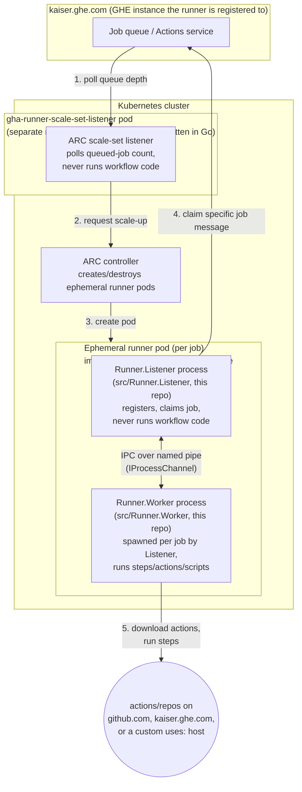
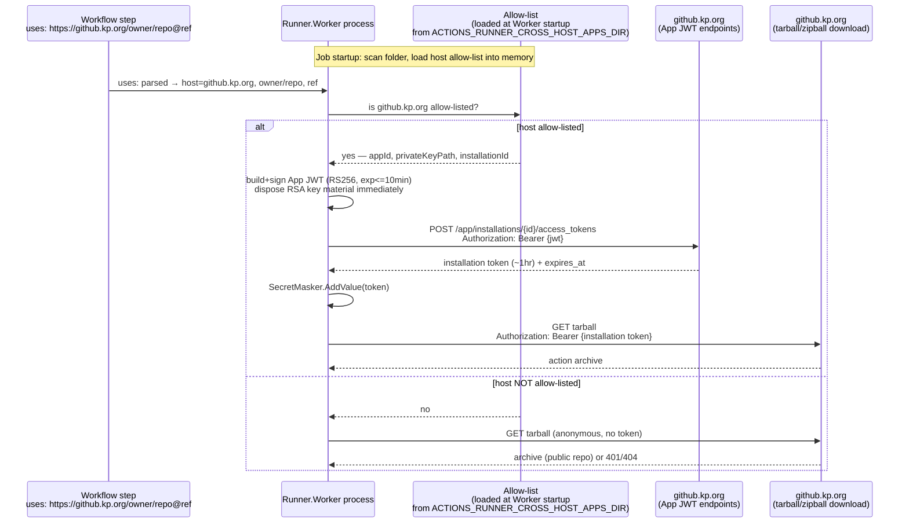

# Secure cross-host authentication for custom `uses:` URLs

**Status**: Option A implemented (`src/Runner.Worker/CrossHostAppTokenProvider.cs`). Option B
remains a documented future hardening step, not implemented.

**Related**: [docs/adrs/fork-0001-custom-uses-url.md](../adrs/fork-0001-custom-uses-url.md)

## Problem

The custom-URL `uses:` feature (`uses: https://<host>/<owner>/<repo>@ref`) currently falls back
to reusing the job's own `GITHUB_TOKEN` as the auth token for whatever host is named in `uses:`.
That token is issued by the runner's own registered server (e.g. `kaiser.ghe.com`) and is **not**
valid on a different GitHub Enterprise instance (e.g. `github.kp.org`) — these are separate
identity realms and do not share tokens. Worse, blindly forwarding a token to any host a workflow
author names in `uses:` is a credential-exfiltration risk: an untrusted or malicious `uses:` value
could cause the runner to leak its token to an attacker-controlled host.

**Rule going forward: default-deny.** Only hosts on an explicit allow-list ever get a token
attached to the download request. Every other host gets an anonymous request (fine for public
repos) — never the primary `GITHUB_TOKEN`, never any other host's credential.

## What already exists in this codebase vs. what's net-new

There is **no existing "load a GitHub App ID + private key" system** in this runner today. What
does already exist is adjacent infrastructure worth reusing as a foundation rather than building
from scratch:

| Existing component | What it actually does | Reusable for this feature? |
| --- | --- | --- |
| `RSAFileKeyManager` / `RSAEncryptedFileKeyManager` (`src/Runner.Listener/Configuration/`) | Stores the **runner's own** RSA keypair used during runner *registration* (proving the runner's identity to the Actions service). Linux/macOS: plain file + `chmod 600`. Windows: DPAPI-encrypted file. | **Yes, as a pattern to mirror** for how the GitHub App private key file is protected at rest. Not a literal loader for App keys — a different keypair, different purpose — but the exact secure-storage convention we should copy. |
| `GitHub.Services.WebApi.Jwt.JsonWebToken` (`src/Sdk/WebApi/WebApi/Jwt/`) | General-purpose RS256 JWT builder, but requires an `Audience` claim and is shaped for VSTS/Azure DevOps-style tokens. | **Not a good fit as-is.** GitHub App JWTs don't use an audience and have a fixed 10-minute max lifetime. Cheaper/cleaner to hand-roll the ~20 lines of JWT construction directly with `System.Security.Cryptography.RSA` than to fight this class's assumptions. |
| `IProcessChannel` IPC between `Runner.Listener` and `Runner.Worker` (`JobDispatcher.cs`) | Already carries the job message, secrets, and (recently) `ActionsDependencies` from Listener to Worker. | Only relevant to **Option B** — the channel already exists and already carries similar Listener→Worker data, so extending it is low-risk *if* we go that route. |

So: nothing to "turn on," but nothing to invent from zero either. Both options below build on the
same existing secure-file-storage convention; they differ only in *which process* loads the key
and mints tokens.

## Process architecture context

Two different "listener" concepts are easy to conflate, so it's worth being explicit before
comparing options — this directly affects the "long-lived vs. per-job" trade-off between them.

- **ARC's scale-set listener** (`gha-runner-scale-set-listener`) is a separate component from a
  separate repo (`actions-runner-controller`, written in Go). It runs in its own pod, polls GitHub
  for queued-job counts, and asks Kubernetes to spin up ephemeral runner pods. It contains none of
  this repo's source and never runs workflow code.
- **This repo's `Runner.Listener`** (`src/Runner.Listener`) is a different thing that happens to
  share the word "listener." It runs *inside* each runner pod/VM, registers with the Actions
  service, claims job messages, and — critically — never executes workflow-authored code itself.
- **`Runner.Worker`** (`src/Runner.Worker`) is spawned by `Runner.Listener` as a **separate OS
  process**, once per job, over a named-pipe IPC (`IProcessChannel`). It's the process that
  actually runs steps/actions/scripts — the untrusted-code-execution surface.

The container image ARC uses (built via [images/Dockerfile](../../images/Dockerfile)) packages
both `Runner.Listener` and `Runner.Worker` binaries into one image, but they still run as two
separate processes at runtime, exactly like a bare VM install.



In ARC's ephemeral mode, a runner pod (and so `Runner.Listener` within it) typically lives for only
one job before being torn down — it isn't "long-lived across many jobs" the way a persistent
VM-installed runner's Listener is. That said, **Option B's core security property still holds**
regardless of pod lifetime: `Runner.Listener` never executes workflow code either way, so keeping
the App private key there still keeps it out of the process that runs untrusted actions. The only
thing lost in ephemeral mode is the convenience of not re-reading the key file every job — which
doesn't matter much if the key is mounted via a Kubernetes Secret anyway.

### Custom `uses:` URL + cross-host token flow (Option A shown; Option B differs only in which process performs the allow-list/JWT/mint steps)



For Option B, replace "Runner.Worker" in the diagram above with "Runner.Listener" for the
allow-list/JWT/token-minting steps, and add one more hop: Listener → Worker over the existing IPC,
carrying only the already-minted, short-lived token — the primary `GITHUB_TOKEN` never appears
anywhere in this flow either way, which is the fix for the credential-leak issue described above.

## Two architecture options

| | Option A: mint in `Runner.Worker` | Option B: mint in `Runner.Listener` |
| --- | --- | --- |
| Where the App private key lives | Loaded into the per-job `Runner.Worker` process | Confined to the long-lived `Runner.Listener` process, never leaves it |
| What crosses process boundaries | Nothing new — no IPC change | Short-lived (1hr), narrowly-scoped installation tokens only |
| Projects touched | `Runner.Worker` only | `Runner.Listener`, `Runner.Sdk`/pipeline model (`AgentJobRequestMessage`), `Runner.Worker` |
| Exposure if Worker process is ever compromised | Long-lived App private key at risk | Only an already-scoped, already-short-lived token at risk (same tier as `GITHUB_TOKEN` today) |
| Implementation effort | Smaller, self-contained | Larger — new IPC field, message plumbing, more test surface |
| Config format (allow-list JSON + PEM path) | Same in both options | Same in both options |

Both options share the exact same on-disk config format and token-minting flow described below —
switching from A to B later would not require reworking the config, only relocating *where* the
minting code runs and adding the IPC hop.

### Option A — allow-list + token minting inside `Runner.Worker`

Everything happens inside the per-job `Runner.Worker` process, at its own startup. No changes to
`Runner.Listener` or the shared `Pipelines.AgentJobRequestMessage` job-message contract.

**Pros**: smaller, self-contained change; no IPC/shared-message-format changes; faster to ship.
**Trade-off**: the GitHub App's private key is loaded into the same process that executes the
job's actions/scripts for the duration of that job, rather than being confined to the longer-lived,
lower-exposure `Runner.Listener` process.

### Option B — allow-list + token minting inside `Runner.Listener`

`Runner.Listener` (long-lived, doesn't execute workflow-authored code, already holds the runner's
own RSA registration key) owns the allow-list and private keys, mints short-lived installation
tokens, and passes only those short-lived tokens down to `Runner.Worker` via the existing
Listener↔Worker IPC (`IProcessChannel`), by adding a field to `Pipelines.AgentJobRequestMessage`
(the same pattern already used to add `ActionsDependencies` to that class).

**Pros**: the long-lived private key never enters the Worker process at all — only short-lived,
narrowly-scoped, already-minted tokens do (same trust tier as `GITHUB_TOKEN` today).
**Trade-off**: touches three projects (`Runner.Listener`, `Runner.Sdk`/pipeline model,
`Runner.Worker`) instead of one.

This document details the config format and token-minting flow once (they're identical between
options), then describes where each option places that logic. **Option A has been implemented**
(`src/Runner.Worker/CrossHostAppTokenProvider.cs`, commit `60b17d82`); Option B remains documented
here as a future hardening step, not implemented.

## Config format and token-minting flow (shared by both options)

### Startup: folder-based allow-list

At startup of whichever process owns this logic (`Runner.Worker` for Option A, `Runner.Listener`
for Option B), scan a configurable directory for `*.json` allow-list files and merge them into a
single in-memory list. Supporting multiple files (rather than one monolithic file) lets different
teams/hosts each own their own file without merge conflicts.

- Directory location: `ACTIONS_RUNNER_CROSS_HOST_APPS_DIR` environment variable, defaulting to
  `<runner_root>/.cross_host_apps/` if unset.
- Each file contains one or more host entries:

```json
{
  "hosts": [
    {
      "host": "github.kp.org",
      "appId": "123456",
      "privateKeyPath": "/etc/actions-runner/keys/github-kp-org-app.pem",
      "installationId": "789012"
    }
  ]
}
```

- `privateKeyPath` is a path to a PEM file, **never inline key material in the JSON**. The PEM
  file must be readable only by the runner service account — same file-permission convention this
  repo already uses for its own RSA registration key
  (`RSAFileKeyManager`: `chmod 600` on Linux/macOS; `RSAEncryptedFileKeyManager`: DPAPI on Windows).
- `installationId` is optional. If omitted, it's resolved dynamically at mint time via
  `GET {apiBase}/app/installations` (using the App's JWT), matching `account.login` against the
  target repo's owner from the `uses:` reference.
- **Host matching is exact, case-insensitive string equality** after `Uri` parsing — never
  `EndsWith`/`Contains` — so e.g. `github.kp.org.evil.com` can never match an allow-list entry for
  `github.kp.org`.

### Token minting flow

Performed lazily, the first time a job's `uses:` references an allow-listed host; cached in memory
for the remainder of that job (the Worker process is per-job, so no cross-job cache is needed).

1. Build a GitHub App JWT: header `{"alg":"RS256","typ":"JWT"}`, payload
   `{"iat": now-60, "exp": now+600, "iss": appId}` (10-minute max lifetime per GitHub's rules;
   `iat` backdated 60s for clock skew). Sign with `RSA.Create()` + `ImportFromPem` + RS256.
   Dispose the `RSA` object immediately after signing to clear key material from memory.
2. Determine the REST API base using the same github.com-vs-GHES convention already built for the
   custom-URL feature (`UrlUtil.IsHostedServer`): `api.{host}` for a dotcom-style host,
   `{host}/api/v3` for a GHES-style host.
3. If no `installationId` configured, resolve it via `GET {apiBase}/app/installations`.
4. `POST {apiBase}/app/installations/{id}/access_tokens` with `Authorization: Bearer {jwt}` →
   returns `{token, expires_at}` (typically 1 hour).
5. `HostContext.SecretMasker.AddValue(token)` immediately on mint, before the token is used
   anywhere else — same as the existing code already does for the primary `GITHUB_TOKEN`.
6. Use the minted token as `ActionDownloadInfo.Authentication.Token` for that action's download,
   exactly the same integration point the custom-URL feature already uses.
7. Refresh proactively if the cached token is within 5 minutes of `expires_at`.

### Fail-closed rules

- Host not on the allow-list → no token attached (anonymous request), never the primary
  `GITHUB_TOKEN`, never another host's credential.
- No installation found for the target owner → fail the action download with a clear error
  ("No GitHub App installation found for owner '{owner}' on host '{host}'"), don't silently fall
  back to anonymous for a host that *is* allow-listed (that would mask a misconfiguration).
- Any minted token is added to the secret masker before use.

### Code locations (Option A — implemented)

- `src/Runner.Worker/CrossHostAppTokenProvider.cs` — the allow-list loader + JWT/token-minting
  component (`ICrossHostAppTokenProvider`, resolved via `HostContext.GetService<T>()`, lazily
  loads the allow-list on first use).
- `ActionManager.BuildCustomUrlDownloadInfoAsync` (`src/Runner.Worker/ActionManager.cs`) — looks up
  the action's host via the provider; uses the minted token if the host is allow-listed, otherwise
  `Authentication` is left null (anonymous).
- `src/Test/L0/Worker/CrossHostAppTokenProviderL0.cs` — unit tests (unlisted host, missing key
  file, explicit `installationId`, dynamic installation lookup, no-installation-found error, token
  caching).

## How to set this up (Option A)

### 1. Create a GitHub App on the target host

On the host you want to allow cross-host `uses:` downloads from (e.g. `github.kp.org`):

1. Create a GitHub App (org or enterprise settings → Developer settings → GitHub Apps).
2. Grant it repository permission **Contents: Read-only** (that's all `tarball`/`zipball` download
   needs). Add more only if your actions also need it.
3. Install the App on the org(s)/repo(s) that hold the actions you want to reference.
4. Note the **App ID** (shown on the App's settings page).
5. Generate a private key for the App ("Generate a private key" button) — this downloads a `.pem`
   file once; there's no way to re-download it later, only regenerate a new one.
6. Optional: note the **Installation ID** from the URL of the installed-app settings page
   (`.../settings/installations/<id>`) if you want to pin it in config instead of relying on
   dynamic lookup by owner.

### 2. Place the private key on the runner

Copy the downloaded `.pem` file onto the runner host/image at a path the runner service account
can read and nothing else can — mirror this repo's own convention for its RSA registration key:

```bash
sudo mkdir -p /etc/actions-runner/keys
sudo cp github-kp-org-app.pem /etc/actions-runner/keys/github-kp-org-app.pem
sudo chown <runner-service-user> /etc/actions-runner/keys/github-kp-org-app.pem
sudo chmod 600 /etc/actions-runner/keys/github-kp-org-app.pem
```

For a container/ARC deployment, mount this from a Kubernetes Secret instead of baking it into the
image.

### 3. Write the allow-list config

Create the config directory (default `<runner_root>/.cross_host_apps/`, or point
`ACTIONS_RUNNER_CROSS_HOST_APPS_DIR` at a directory of your choice) and add a `*.json` file:

```bash
mkdir -p /actions-runner/.cross_host_apps
cat > /actions-runner/.cross_host_apps/github-kp-org.json <<'EOF'
{
  "hosts": [
    {
      "host": "github.kp.org",
      "appId": "123456",
      "privateKeyPath": "/etc/actions-runner/keys/github-kp-org-app.pem",
      "installationId": "789012"
    }
  ]
}
EOF
```

Omit `installationId` if you'd rather it be resolved dynamically per-owner at mint time (useful if
the App is installed across many orgs on that host). No runner restart is required beyond the next
job — the allow-list is loaded once per `Runner.Worker` process (i.e., once per job).

### 4. Reference it from a workflow

No special syntax beyond the custom-URL `uses:` form already documented in
[fork-0001-custom-uses-url.md](../adrs/fork-0001-custom-uses-url.md):

```yaml
steps:
  - uses: https://github.kp.org/some-org/some-action@v1
```

If `github.kp.org` is allow-listed, the download is authenticated with a freshly minted GitHub App
installation token. If it isn't, the download is anonymous (works for public repos, fails for
private ones with a normal 404/403 from the download itself — not a runner-level error).

### 5. Troubleshooting

All of these come from `CrossHostAppTokenProvider` and are visible in the job's `resolve_actions`/
`download_action` step output:

| Message | Cause | Fix |
| --- | --- | --- |
| `Cross-host app entry for host '<host>' is misconfigured: '<file>' is missing required field(s) appId/privateKeyPath.` | The JSON entry is missing `appId` or `privateKeyPath`. | Fix the JSON file for that host. |
| `Cross-host app entry for host '<host>' is misconfigured: private key file '<path>' not found.` | `privateKeyPath` doesn't point to a real, readable file. | Check the path and file permissions. |
| `Unable to read GitHub App private key file '<path>': ...` | File exists but couldn't be read (permissions, disk error). | Check ownership/permissions match the runner service account. |
| `Private key file '<path>' is not a valid PEM-encoded RSA private key.` | Wrong file, or corrupted/re-encoded key. | Re-download the key from the App's settings page. |
| `No GitHub App installation found for owner '<owner>' on host '<host>'.` | `installationId` omitted and the App isn't installed on that owner's account. | Install the App on that org/user, or set `installationId` explicitly. |
| `Failed to list GitHub App installations on host '<host>' (HTTP ..., request id: ...)` / `Failed to mint a GitHub App installation token ...` | Network/API error talking to the host, or App ID is wrong. | Check connectivity to the host's API, and that `appId` matches the App exactly. |

A host that's simply **not mentioned** in any allow-list file is not an error — it's the normal
case for public actions and results in a plain anonymous download.

### Code locations (Option B)

- New allow-list loader + token-minting component in `Runner.Listener` (e.g.
  `CrossHostAppTokenProvider`), initialized once at Listener startup — same responsibilities as
  Option A's version, just living in a different process, alongside the existing
  `RSAFileKeyManager`/`RSAEncryptedFileKeyManager`.
- `Pipelines.AgentJobRequestMessage` (`src/Sdk/DTPipelines/Pipelines/AgentJobRequestMessage.cs`)
  gains a new field, e.g. `CrossHostActionTokens: Dictionary<string, string>` (host → minted
  token), mirroring how `ActionsDependencies` was added to this same class.
- `JobDispatcher.cs` (`src/Runner.Listener/`) resolves/mints tokens for any allow-listed hosts and
  populates that field before `processChannel.SendAsync(...)` sends the job message to the newly
  spawned Worker process.
- `ActionManager.BuildCustomUrlDownloadInfo` (`src/Runner.Worker/ActionManager.cs`) changes to read
  the already-minted token for its host from `ExecutionContext`'s job message data — never mints
  anything itself, never touches a private key.

## Alternatives considered and rejected

- **Cross-instance OIDC trust** between the two GHE instances — no static secrets at all in
  theory, but not a supported GHES-to-GHES federation feature today.
- **Shared PAT per host** — simpler, but long-lived, broad-scoped, tied to a human account, harder
  to rotate/audit than GitHub App installation tokens.
- **Workflow author supplies their own token** via `with:`/secrets — pushes risk to every workflow
  author, easy to leak in YAML/logs, no central rotation/control.
