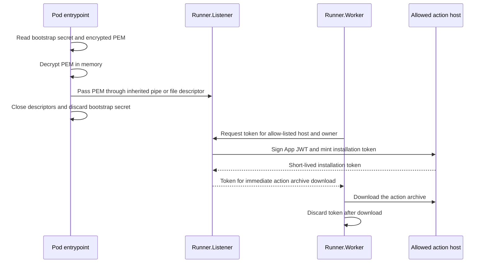

# KMS-free bootstrap hardening for cross-host GitHub App credentials

**Status**: Design option — not implemented. This is a possible follow-on to the implemented
[Worker-based setup](secure_app_id.md), and complements the
[Listener-minting option](secure_app_id_listener_option.md).

**Goal**: Reduce the chance that a GitHub App private key is accidentally exposed from a runner
pod without adding a KMS/HSM service or a long-running credential sidecar.

## Decision summary

Keep the encrypted App private key in the runner deployment, supply a separate bootstrap secret
only when the pod starts, and use that secret to decrypt the PEM once. Give the decrypted PEM only
to `Runner.Listener` through an inherited pipe or file descriptor; do not write it to a normal
file, command-line argument, environment variable, job message, or log. The entrypoint closes the
bootstrap input immediately after the handoff.

`Runner.Listener` then owns the long-lived App private key for the life of the pod and mints
short-lived installation tokens only when an allowed custom-host action must be downloaded.
`Runner.Worker` receives a token for the immediate archive download but never receives the PEM or
the bootstrap secret.

This design requires the Listener-minting option to be implemented. The current implementation
mints in `Runner.Worker`, so it cannot enforce this process boundary yet.

## Why not mint one token at pod startup?

Action resolution happens when a job is assigned and prepared, not reliably when the runner pod
first starts. A one-time startup token can expire while a pod waits for a job, and does not support
later action resolution, retries, or multiple jobs. Keep the **bootstrap decryption secret** only
for startup, but retain the decrypted PEM exclusively in Listener memory until the pod drains. The
Listener then mints and caches tokens just in time, using the existing exact host/owner allow-list.

For the recommended ephemeral-runner model, drain and terminate the pod after one job. This keeps
the period in which the Listener retains the decrypted key bounded to that pod's short lifecycle.

## Intended flow

The entrypoint must pass the PEM before it launches any process that can execute workflow code.
The inherited descriptor is marked close-on-exec so it cannot leak to children. The Listener copies
only the data it needs, closes its read end after startup, and the Worker receives neither
bootstrap material nor a descriptor capable of reading it.

## Bootstrap material delivery

Kubernetes has no native "single-use secret through a file descriptor" primitive. The simple,
KMS-free input is a Kubernetes Secret mounted read-only **only in the runner container**. The
entrypoint reads the bootstrap secret and encrypted PEM, performs the in-memory decrypt/handoff,
and closes the files before starting normal runner processing.

Do not deliver the bootstrap secret through environment variables, command-line arguments, the
allow-list JSON, a work directory, or output. They are too easy to expose through diagnostics,
process inspection, accidental logging, or a later workflow step.

An encrypted PEM protects the copy stored in an image, deployment manifest, source-control system,
or backup when the bootstrap secret is stored separately. It is an **at-rest** control. It does not
by itself protect a live process that has already decrypted the PEM.

## Security boundary and honest limitations

This option meaningfully reduces accidental exposure and prevents `Runner.Worker` from directly
reading the App private key. It does **not** protect the key from a malicious workflow that obtains
root-equivalent control over the same runner container or process namespace as `Runner.Listener`.
Such code may inspect another live process, attach a debugger, or intercept its operations.
Clearing byte arrays and closing descriptors are good hygiene, but are not a security boundary
against same-container root.

The important boundary is therefore process **and container** isolation:

- Run workflow steps in a separate job container. Mount bootstrap material and any encrypted PEM
  only into the runner container, never the job container.
- Avoid `privileged`, `hostPID`, broad `hostPath` mounts, host networking, and Docker-socket access
  in workflow containers. Drop capabilities, disable privilege escalation, and use an appropriate
  seccomp profile.
- Run the runner container without root where practical. Do not let the job container become able
  to control the runner container through the container runtime.
- Keep the GitHub App limited to **Contents: Read-only**, installed only for the intended owners or
  repositories, and preserve the exact host/owner allow-list. Never forward the job's
  `GITHUB_TOKEN` to another host.

With these controls, a workflow author can receive only the narrowly scoped, short-lived
installation token needed for the allowed action archive—not the App private key that can mint
future tokens.

## Implementation outline (future)

1. Implement [secure_app_id_listener_option.md](secure_app_id_listener_option.md) so the Listener,
   not the Worker, owns allow-list loading and GitHub App token minting.
2. Add a runner startup input supported by the Listener for PEM material received via an inherited,
   close-on-exec descriptor. It must not accept raw key material from job messages or workflow
   inputs.
3. Add a small, external pod entrypoint script or launcher responsible only for decrypting the PEM
   and handing it to the Listener. Keep crypto/deployment mechanics out of general workflow code.
4. Add tests confirming that the Worker cannot obtain private-key material, unapproved host/owner
   pairs receive no token, descriptors are not inherited by child processes, and temporary token
   values are masked before use.
5. Document the required pod security settings and make the runner ephemeral (one job per pod)
   where ARC deployment policy permits it.

This preserves the current configuration model—the host/owner allow-list and GitHub App settings
do not need to change—while moving the private key to the safer Listener-side boundary.

## When to use this option

Choose this design when the team wants a practical improvement over a plaintext PEM mounted into
the Worker, accepts that Kubernetes is still trusted to deliver the bootstrap Secret, and does not
want to operate KMS/HSM infrastructure or a credential sidecar.

If the requirement becomes "even a root compromise of the runner container must not be able to use
the signing key," this design is not sufficient. A remote signing boundary such as a KMS/HSM is
required for that stronger threat model.
