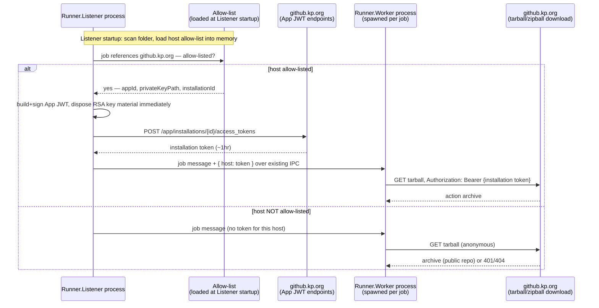

# Advanced option: mint cross-host tokens in `Runner.Listener` instead of `Runner.Worker`

**Status**: Documented alternative — not implemented. The implemented approach (Option A) is in
[secure_app_id.md](secure_app_id.md); this file describes a stronger-isolation alternative for
future hardening, kept separate so the main doc stays focused on the setup guide for what's
actually running today.

**Related**: [secure_app_id.md](secure_app_id.md) (main doc, includes the shared config format and
token-minting flow both options rely on) · [fork-0001-custom-uses-url.md](../adrs/fork-0001-custom-uses-url.md)

## Why this exists

`Runner.Worker` is a separate OS process per job that runs the actual workflow-authored
actions/scripts — it's the untrusted-code-execution surface. The implemented approach (Option A)
loads the GitHub App private key directly into that process to mint installation tokens. That's a
reasonable trade-off for a first cut (see [secure_app_id.md](secure_app_id.md)'s "Process
architecture context" for why `Runner.Listener` never executes workflow code either way), but a
stronger design keeps the long-lived private key out of the Worker process entirely.

## The alternative: mint in `Runner.Listener`

`Runner.Listener` (long-lived relative to a single job, doesn't execute workflow-authored code,
already holds the runner's own RSA registration key via `RSAFileKeyManager`/
`RSAEncryptedFileKeyManager`) would own the allow-list and private keys, mint short-lived
installation tokens, and pass only those already-minted tokens down to `Runner.Worker` — never the
private key itself.

| | Option A (implemented): mint in `Runner.Worker` | Option B (this doc): mint in `Runner.Listener` |
| --- | --- | --- |
| Where the App private key lives | Loaded into the per-job `Runner.Worker` process | Confined to `Runner.Listener`, never leaves it |
| What crosses process boundaries | Nothing new — no IPC change | Short-lived (1hr), narrowly-scoped installation tokens only |
| Projects touched | `Runner.Worker` only | `Runner.Listener`, `Runner.Sdk`/pipeline model (`AgentJobRequestMessage`), `Runner.Worker` |
| Exposure if Worker process is ever compromised | Long-lived App private key at risk | Only an already-scoped, already-short-lived token at risk (same tier as `GITHUB_TOKEN` today) |
| Implementation effort | Smaller, self-contained (done) | Larger — new IPC field, message plumbing, more test surface |
| Config format (allow-list JSON + PEM path) | Same as Option A | Same as Option A — switching later doesn't require reworking the config |

## Mechanism

1. `Runner.Listener` loads the same allow-list config described in
   [secure_app_id.md](secure_app_id.md#config-format-and-token-minting-flow) at its own startup.
2. When dispatching a job, `Runner.Listener` mints (or reuses a cached) installation token for any
   allow-listed host the job's workflow references, using the exact same JWT-build and
   mint-installation-token steps already implemented in `CrossHostAppTokenProvider` — just running
   in `Runner.Listener` instead of `Runner.Worker`.
3. The minted token(s) are attached to the job message and sent to `Runner.Worker` over the
   existing named-pipe IPC (`IProcessChannel`), the same channel that already carries the job
   message, secrets, and (as of a recent upstream merge) `ActionsDependencies`.
4. `Runner.Worker`'s `ActionManager.BuildCustomUrlDownloadInfoAsync` reads the already-minted token
   for its host from the job message data instead of calling a token provider that owns a private
   key — it never touches key material at all.

The private key never appears in this diagram past step 2 — it's disposed immediately after
signing the JWT, and only the resulting short-lived token crosses into `Runner.Worker`.

## Code locations (not implemented)

- New allow-list loader + token-minting component in `Runner.Listener` (mirroring
  `CrossHostAppTokenProvider`'s responsibilities, just relocated), initialized once at Listener
  startup, alongside the existing `RSAFileKeyManager`/`RSAEncryptedFileKeyManager`.
- `Pipelines.AgentJobRequestMessage` (`src/Sdk/DTPipelines/Pipelines/AgentJobRequestMessage.cs`)
  gains a new field, e.g. `CrossHostActionTokens: Dictionary<string, string>` (host → minted
  token), mirroring how `ActionsDependencies` was added to this same class.
- `JobDispatcher.cs` (`src/Runner.Listener/`) resolves/mints tokens for any allow-listed hosts and
  populates that field before `processChannel.SendAsync(...)` sends the job message to the newly
  spawned Worker process.
- `ActionManager.BuildCustomUrlDownloadInfoAsync` (`src/Runner.Worker/ActionManager.cs`) would
  change to read the already-minted token for its host from the job message data instead of
  calling `ICrossHostAppTokenProvider` — never minting anything itself, never touching a private
  key.

## When to consider switching

Move to this design if the threat model changes such that Worker-process compromise (e.g. a
vulnerability in an action's own script/container execution path) becomes a higher-priority
concern than the implementation cost of the IPC/message-format change. Since the config format is
identical, migrating existing allow-list files needs no changes — only the code that reads them.
